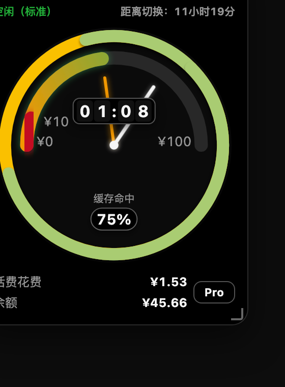
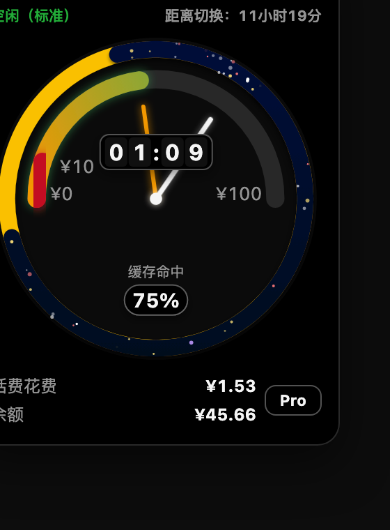
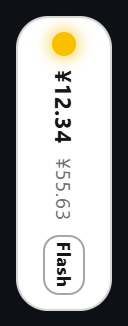
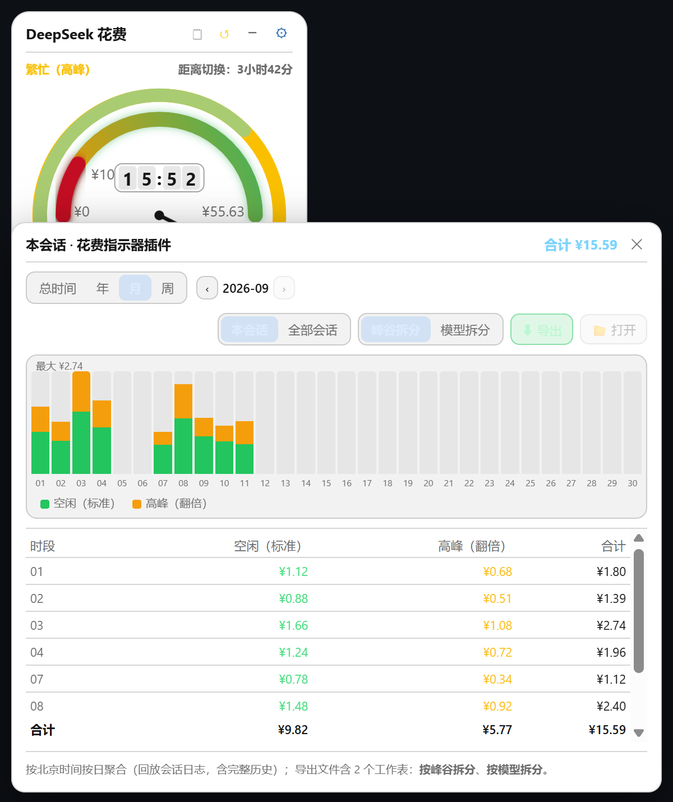
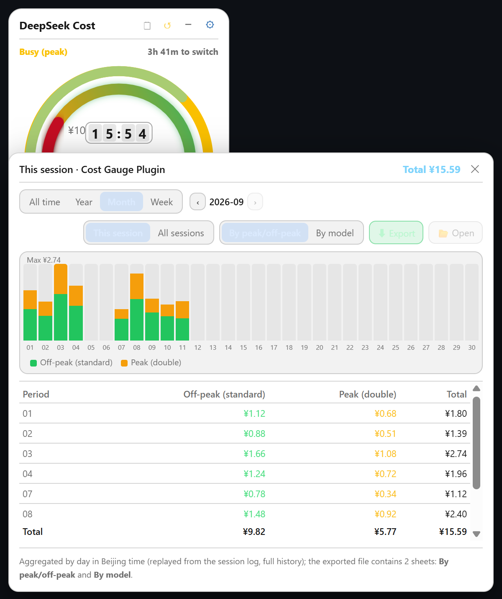

# dsh-cost-gauge-plus

中文 | [English](README.en.md)

DeepSeek Harness（`dsh`）的**花费仪表**：在 Web 界面**左侧靠上**显示一个**可缩放、可展开/缩小**的浮动窗口，实时显示 DeepSeek API 花费与余额，用**极简时钟**（仅一根时针 + 双色外圈）指示当前时段费率是「空闲」还是「繁忙」，余额低于设定阈值时窗口顶部**小红灯闪烁报警**。支持**多皮肤切换**（经典时钟 / 极简数字 / 环形仪表 / 迷你状态条）。

> 💡 **本插件与 dsh-cost-gauge 的关系**：`dsh-cost-gauge-plus` 是 **dsh-cost-gauge 的独立维护版本**（由 v1.4 派生），内部标识（包名 / 插件 id / API 路径 / CSS 前缀）已全部隔离，可与原 `dsh-cost-gauge` **并存安装**、互不干扰。

## 截图

以下实拍图来自 dsh-cost-gauge-plus 自身（多皮肤可在窗口齿轮菜单随时切换）：

| 经典时钟（默认） | 测试1（星空皮肤，深色模式） |
| --- | --- |
|  |  |

> 测试1 皮肤在深色模式下将空闲弧显示为深邃星空蓝渐变（#040a3a→#00081e），弧内星点会"亮起→变暗消失→随机换位重现"。

## 本次更新（v1.5.0）

- **窗口尺寸变化时自动让位**：拉伸/缩放窗口后，如果浮窗压住了中间对话的**文字区**，会自动挪进「文字区 ↔ 侧栏」之间的**留白**：留白够宽就停在**留白正中、靠下部分**（贴窗口底部；若会压到输入框，则停在输入框正上方 8px），留白不够宽才退回侧栏那一列。
  - 优先级：**中间文字区（绝不遮挡）> 底部输入框 > 两侧侧栏**；同分时保持「偏左往左、偏右往右」并尽量少移动。
  - 只在**窗口尺寸变化**时触发（150ms 防抖），不干扰手动拖拽；竖版小条模式下不参与。
  - 何时能停进留白：单侧留白需 ≥ 浮窗宽 + 16px。默认 264px 宽时约需**窗口 ≥ 1792px**（中间列 ≥ 1512px，侧栏 280 展开、右侧栏关闭）；缩到最小 200px 时约需 1569px。
- **侧栏收起时自动停靠**：DSH 自动收起侧栏（或视口很窄）时，竖版小条自动停到**侧栏右侧**；侧栏展开时停到「会话 / 工作区」标题下方；退出竖版时回到进入前的皮肤与展开状态（停靠位置不写入本地存储）。
- 竖版小条宽度 48px → **36px**，更省空间；点一下仍可展开。
- 内部修正：让位判定用的「对话内容区」按 `--dsh-chat-content-width`（面板内居中的内容列）计算，并正确解析 `clamp()/calc()` 表达式；取不到时依次退回「输入卡宽度 → 整个中间面板」，避免把面板两侧的留白误判成对话区。

## 本次更新（v1.4.0）

| 窗口变窄 → 竖版最小化 |
| --- |
|  |

- **窗口自适应（竖版最小化）**：用 `ResizeObserver` 观察视口宽度，**≤ 779px（即 < 780px）** 自动切换为 48px 宽的**竖版最小化**（自上而下：状态灯 → 话费 → 余额 → 模型徽标，均竖排），**点击即展开**；窗口回到 **≥ 860px** 自动退出并恢复进入前的**皮肤与展开/折叠状态**。
  - 带**迟滞**（进入 780 / 退出 860），避免临界点反复抖动；手动点开过竖版后，本段窄窗口内不再自动收窄（窗口回到 860px 以上才重新启用）。
  - 进入/退出以及视口变化时都会把浮窗**钳制在窗口内**（避免 48px 竖条停在屏幕外点不到）。
  - 阈值可覆盖：`localStorage` 的 `dsh-cost-gauge-plus:narrowEnter` / `dsh-cost-gauge-plus:narrowExit`。

## 本次更新（v1.5.0，与 dsh-cost-gauge 同步）

| 花费记录面板（中文） | Spend records panel (English) |
| --- | --- |
|  |  |

- **费用计算口径修正**：宿主改为回放会话事件日志，按「事件发生时刻的费率 × 当时的模型」逐笔计价——空闲时段按空闲价、高峰时段按高峰价后相加；修掉旧版"进入高峰后整段历史按高峰价重算（费用翻倍）"的问题；`llm/retry-started` 与相同 turn/step 的重复样本按官方投影口径替换而非累加，记录覆盖会话完整历史。
- **新增「记录 / 归零」两个图标按钮**（标题栏内，无边框小图标 + 悬停提示）：
  - 记录面板支持 `总时间 / 年 / 月 / 周` 筛选与翻页、**柱状图**（峰谷/模型堆叠）、明细表格；明细只列**有使用记录**的时段；范围可切 `本会话 / 全部会话`；面板可拖动、可覆盖浮窗、越界自动拉回窗口内；
  - 归零为两步确认，把当前累计作为基线后从 ¥0.00 重新累计（不删历史）。
- **导出 Excel 升级为真正的 `.xlsx`**（OOXML，零依赖手写 zip 写入器，Excel/WPS 直接打开无格式警告）：两个工作表（按峰谷拆分 / 按模型拆分）+ 首行导出说明；默认文件名 `<会话名称>_<起>-<止>.xlsx`；设置里可指定 Excel 默认保存位置（已设置则直接落盘不弹窗），导出后 `📂 打开` 定位文件。
- **宿主侧记账**：每 15 秒回放会话事件日志并持久化到 `~/.dsh/cost-gauge-plus/ledger.json`（与 dsh-cost-gauge 的数据文件互相独立）。
- **中英双语界面**：跟随 DSH 客户端语言设置，取不到时跟随系统/浏览器语言（`zh*` → 中文，其余 → English）。

## 功能

- 🕐 **12 小时时钟造型**：外圈圆环按 o'clock 位置双色表示费率——**绿色 = 空闲（标准）**、**黄色 = 繁忙（高峰）**（周末全天绿色）；白色时针指示当前时间。
- 🛢️ **内圈里程表（余额油量计）**：弧形量表，满刻度 = 历史最高余额，**红色段 = 余额预警段**，橙→绿渐变弧 = 当前余额位置。
- 🖐️ **可拖拽 / 可缩放**：按住标题栏拖动；拖拽右下角把手放大或缩小窗口（时钟随之缩放），位置与大小自动记忆。
- 📱 **窗口自适应**：窗口变窄（视口 ≤ 779px）时自动切为 **36px 竖版最小化**（灯 + 话费 + 余额 + 模型徽标），点击展开；窗口恢复（≥860px）自动还原皮肤与展开/折叠态；侧栏自动收起时竖版小条停靠到侧栏右侧、侧栏展开时停到「会话 / 工作区」标题下方。
- 🪟 **窗口尺寸变化自动让位**：浮窗压住中间文字区时自动挪进「文字区 ↔ 侧栏」之间的留白（正中靠下）；优先级为 文字区 > 底部输入框 > 两侧侧栏。
- 🔍 **展开 / 缩小两种状态**：
  - 展开态：时钟 + **话费花费、余额、命中率、当前模型** + 距下次切换倒计时；
  - 缩小态：只显示**话费、余额、剩余百分比**，加**两盏状态灯**——🟡 黄=繁忙、🟢 绿=空闲（当前状态亮起、另一盏暗掉），每盏灯外圈是**「状态所剩进度」饼环**。
- 💰 **会话花费**：按官方峰谷价实时换算当前会话的 token 花费（缓存命中/未命中、输出分桶计价）。
  - 繁忙（高峰）：北京时间周一至周五 09:00–12:00、14:00–18:00
  - 空闲（标准）：其余时间（含周六、周日全天），价格为高峰的一半
- 🔴 **红灯报警**：余额低于阈值（默认 ¥10）时，窗口顶部小红灯闪烁报警；余额充足时熄灭。
- ⚙️ **阈值可设**：点齿轮即可改报警阈值，立即生效并记住（localStorage）。

## 安装

### 一键安装（推荐，无需 git）

PowerShell 复制整行回车（自动补齐 dsh，无需本机 git）：

```powershell
irm https://raw.githubusercontent.com/wjingshan/dsh-cost-gauge-plus/main/install.ps1 | iex
```

> 一键安装**自动装最新稳定版**（GitHub 最新 Release tag，发版后无需改脚本）。想装开发版或锁指定版本，先下载脚本再带参数运行：
>
> ```powershell
> irm https://raw.githubusercontent.com/wjingshan/dsh-cost-gauge-plus/main/install.ps1 -OutFile install-dsh-cost-gauge-plus.ps1
> .\install-dsh-cost-gauge-plus.ps1 -Ref main        # 装 main 开发版
> .\install-dsh-cost-gauge-plus.ps1 -Ref v1.5.0      # 锁指定版本
> ```

仓库尚未推送时可先用本地脚本装（`-Source` 指定本地目录）：

```powershell
powershell -ExecutionPolicy Bypass -File .\install.ps1 -Source .\dsh-cost-gauge-plus
```

### 手动安装（示例锁 v1.5.0，可换成任意 Release tag）

```sh
# 从 git 安装（需要本机有 git，锁稳定版 tag）
dsh plugin --profile web add github:wjingshan/dsh-cost-gauge-plus#v1.5.0

# 无 git 时用 tarball 直链（锁稳定版）
dsh plugin --profile web add https://github.com/wjingshan/dsh-cost-gauge-plus/archive/refs/tags/v1.5.0.tar.gz

# 想装最新开发版（main 分支）
dsh plugin --profile web add github:wjingshan/dsh-cost-gauge-plus#main

# 从本地目录安装（链接方式，改 lib/*.js 后刷新页面即生效）
dsh plugin --profile web add link:/path/to/dsh-cost-gauge-plus
```

装完**重启** `dsh web`，刷新页面即可看到左上角浮动窗。

```sh
dsh web
```

## 配置

余额阈值既可在浮动窗里点齿轮改，也可在 profile 的 `cordis.patch.yml` 里覆盖：

```yaml
- update:
    - id: cost-gauge-plus
      config:
        threshold: 10          # 余额报警阈值（人民币）
        baseUrl: 'https://api.deepseek.com'
        apiKeyEnv: 'DEEPSEEK_API_KEY'
        refreshSeconds: 30     # 余额查询缓存秒数
```

> 覆盖时需完整重述该行需要的全部 config 键（patch 按行整体替换 config，不做深合并）。

## 发布新版本

改完代码后，用 `release.ps1` 一条命令完成：提交 → 升版本 → 推送 → 创建 GitHub Release。

```powershell
.\release.ps1 -Message "feat: 新增 xxx"                 # 默认 patch（1.0.0 → 1.0.1）
.\release.ps1 -Type minor -Message "feat: 新增 xxx"     # minor（→ 1.1.0）
.\release.ps1 -Version 1.2.0 -Message "feat: 新增 xxx"  # 显式版本号
.\release.ps1 -Message "..." -DryRun                    # 预演（不真正执行）
```

- Release 说明默认从「上一个 tag 以来的提交历史」自动生成，也可 `-Notes "…"` 自定义。
- 创建 Release 需要 PAT：设置环境变量 `GH_TOKEN`（fine-grained，仓库权限 Contents 读写），或运行时按提示输入。
- 发版后无需改任何脚本——`install.ps1` 会自动安装最新 Release tag。

## 数据与安全

- 余额经官方 `GET /user/balance` 查询，API Key 只在宿主侧解析（credentials 接缝 / 环境变量），**绝不下发浏览器**。
- 花费由宿主**回放会话事件日志**（`assistant/message` / `assistant/attempt` 的 usage 与时间戳 + `request/header` 的模型），按事件时刻的峰谷价逐笔换算；缓存写入不单独计费（与官方口径一致）。
- 纯 ESM、零第三方依赖：宿主只用 Node 内置模块（记账见 `lib/ledger.js`），浏览器半身是原生 JS（无 React）。

## 目录结构

```
dsh-cost-gauge-plus/
├── package.json          # dsh.bundle（宿主）+ dsh.client（浏览器）声明
├── cordis.patch.yml      # 插件行插入（含默认 config）
├── install.ps1           # 一键安装脚本（irm … | iex）
├── release.ps1           # 一键发布脚本（提交+升版本+推送+创建 Release）
├── docs/
│   ├── alipay-qr.jpg     # 支付宝收款码（README 赞助区引用）
│   └── classic.png / test1.png   # 皮肤截图
├── lib/
│   ├── index.js          # 宿主半身：余额查询 + 日志回放记账 + 峰谷判定 + /api/cost-gauge-plus/* 路由
│   ├── ledger.js         # 宿主：记账/持久化/每日聚合/xlsx 写出/原生选目录与定位
│   └── client.js         # 浏览器半身：多皮肤浮动窗 + 记录面板（中英双语）
└── README.md / README.en.md
```

## License

MIT

---

## ☕ 赞助

`dsh-cost-gauge-plus` 由我独立维护（自 [dsh-cost-gauge](https://github.com/wjingshan/dsh-cost-gauge) v1.4 派生）。如果它帮到了你，欢迎请我喝杯咖啡 ☕


<div align="center">

**感谢你的支持！** 💙

</div>
